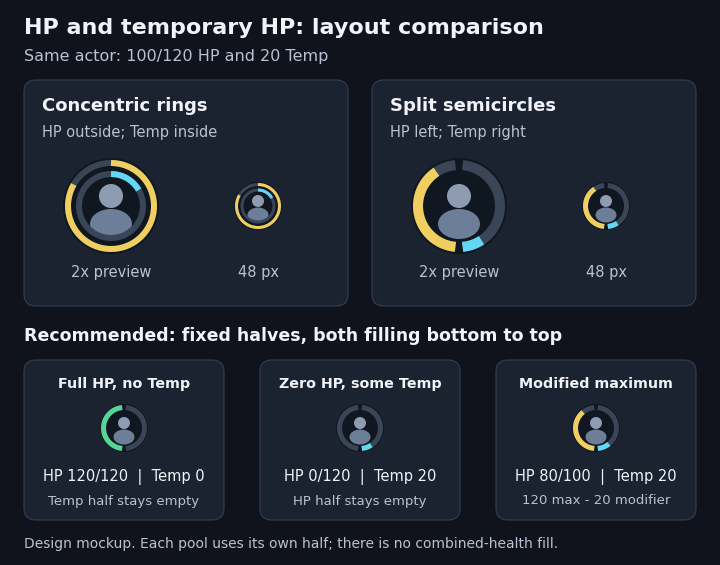

# Tracker Enhancements v1.5 health design

Status: proposal for review, not implemented. Prepared against Tracker Enhancements 1.4.2 at `f748f8e` and D&D5e release 6.0.2 on 2026-09-16. This document specifies the requested HP overhaul while keeping initiative and targeting behavior outside its scope.

The maintainer confirmed that both HP and Temp fields must accept an absolute amount or a signed change. An absolute entry sets the selected pool; a positive signed entry increases that pool. A negative entry in **either field applies the full amount as damage**, consuming Temp first and spilling into regular HP. In particular, Temp `-25` at 100 HP and 20 Temp means **95 HP and 0 Temp**. This is confirmed behavior, not an unresolved boundary.

## Compatibility and confirmed causes

Use D&D5e 6.0.2 as the implementation baseline. Its [system manifest](https://github.com/foundryvtt/dnd5e/blob/release-6.0.2/system.json) requires Foundry 14.367 or newer. Earlier validation against the public 14.365 demo does not establish compatibility with this system release. Test on 14.367 and the maintainer's current supported V14 build. Check 6.0.0 as well before claiming coverage of the entire released 6.0 line.

Three separate behaviors explain the reported problems:

- [D&D's token document](https://github.com/foundryvtt/dnd5e/blob/release-6.0.2/module/documents/token.mjs) adds Temp HP to the HP bar value. The module currently uses that combined value for its circle, making 100 HP plus 20 Temp look like 120/120.
- [D&D's actor implementation](https://github.com/foundryvtt/dnd5e/blob/release-6.0.2/module/documents/actor/actor.mjs) routes changes to the `attributes.hp` bar through `applyDamage`. Its absolute bar input represents the combined pool, so simply swapping our existing absolute HP update for that call would consume Temp unexpectedly.
- The module appends an input beside the native tracked-resource display. [Foundry's combatant resource](https://foundryvtt.com/api/v14/classes/foundry.documents.Combatant.html#resource) can be HP, AC, or another configured attribute. The public V14.365 tracker source gates that number by Observer permission, rather than token friendliness. The new design must explicitly enforce the maintainer's friendly-only rule, and verify the current V14 template before implementation.

An adapter should activate for `game.system.id === 'dnd5e'`, a supported HP model, and the canonical HP resource. Detect the required public methods as well as the system version. Preserve the existing generic-resource behavior elsewhere. A custom Bar 1 resource must not be mistaken for D&D HP or gain a Temp field. Group/encounter actors without valid HP and group header rows receive no invented health controls.

## Input behavior

The fields display regular HP and Temp separately. Keep Enter/blur to commit and Escape to cancel. Parse the input into an operation that retains its sign and whether it is absolute; do not turn every input into a precomputed HP total. D&D values must be finite whole numbers. Reject blanks, malformed input, and fractional amounts before making a system call. Zero is valid.

Each row below starts independently at **100/120 HP and 20 Temp**:

| Field and entry | Meaning | Result: HP / Temp |
| --- | --- | --- |
| HP `-5` | Apply 5 damage; Temp absorbs it first | 100 / 15 |
| HP `-25` | Apply 25 damage, spilling through Temp | 95 / 0 |
| HP `+3` | Heal regular HP | 103 / 20 |
| HP `+50` | Heal up to effective maximum | 120 / 20 |
| HP `95` | Set regular HP; retain Temp | 95 / 20 |
| HP `0` | Set regular HP to zero; retain Temp | 0 / 20 |
| Temp `+3` | Increase the current Temp pool by 3 | 100 / 23 |
| Temp `-5` | Apply 5 damage; Temp absorbs it first | 100 / 15 |
| Temp `10` | Set the Temp pool, including a lower value | 100 / 10 |
| Temp `0` | Clear Temp | 100 / 0 |
| Temp `-25` | Apply all 25 damage, spilling through Temp | 95 / 0 |

With zero Temp, entering `-5` in the Temp field still deals 5 damage to regular HP. Do not mistake an unchanged Temp value for a no-op. Absolute Temp `0` only clears Temp; it never deals overflow damage. Field help should make this distinction clear: for example, `20: set Temp; +3: add Temp; -5: apply 5 damage, using Temp first`.

The proposed public API routing is:

| Operation | System call / responsibility |
| --- | --- |
| Signed HP change `d` | `actor.modifyTokenAttribute('attributes.hp', d, true, true)`; D&D delegates to `applyDamage` |
| Absolute HP `n` | Bound to `0..hp.effectiveMax`, then `actor.modifyTokenAttribute('attributes.hp.value', n, false, false)` |
| Temp increase `d > 0` | Read current Temp at commit time and call `actor.applyDamage([{type: 'temphp', value: currentTemp + d}], {ignore: true})` |
| Negative Temp entry `d < 0` | `actor.modifyTokenAttribute('attributes.hp', d, true, true)`; pass the full signed amount, exactly as for HP-field damage |
| Absolute Temp `n` | `actor.modifyTokenAttribute('attributes.hp.temp', n, false, false)`; allow any valid non-negative whole number |

Absolute assignments intentionally use the scalar attribute route, because they set one specific pool. They still use Foundry's public attribute hook and D&D's normal document-update lifecycle, but do not invoke the D&D damage-calculation hooks. [Foundry documents the distinction between scalar values and bars](https://foundryvtt.com/api/v14/classes/foundry.documents.Actor.html#modifyTokenAttribute). Do not claim every operation follows an identical pipeline.

For example, calling the absolute `attributes.hp` bar operation with 100 while at 100 HP plus 20 Temp would remove the Temp. That is not an acceptable implementation of entering `100` in a field labeled HP.

The typed Temp increase supplies the intended new total, not just the increment: D&D's Temp grant processing keeps the higher pool. Supplying only `3` would fail to turn 20 into 23. The user-requested `+3` is a manual pool adjustment, not a normal spell grant. Normal item/spell Temp grants continue using D&D's non-stacking rules.

Numeric manual damage follows the system's numeric-entry convention, which defaults to ignoring damage modifiers, resistances, immunities, and thresholds. Thus `-5` is a final 5 damage, with Temp handling and system hooks, not an unspecified damage roll for the module to adjudicate. Typed attack/spell damage remains in D&D's own workflow. External hooks may modify or cancel an operation; always display the resulting actor state instead of forcing the initially predicted result.

[D&D's HP lifecycle](https://github.com/foundryvtt/dnd5e/blob/release-6.0.2/module/data/actor/templates/attributes.mjs) handles concentration and status-related follow-up. Do not issue additional concentration rolls, death-state updates, or duplicate damage hooks. Absolute corrections can still invoke normal HP-update side effects; the design does not promise silent corrections.

## Health data and maximum modifiers

Separate resource identity, values, permissions, and presentation. For D&D HP, read prepared `hp.value`, `hp.temp`, and `hp.effectiveMax` from the actor. `tempmax` modifies the effective maximum; it is not the temporary-HP pool. Retain the token bar API for its resource metadata and editability, not its combined numerator. Keep optional Bar Brawl visibility rules; for canonical D&D HP, derive the two pool values from the actor even if Bar Brawl supplies a combined display value. Custom resources retain their own resource handling.

Maximum modifiers need targeted work, rather than a replacement for D&D's maximum-HP rules:

- The current [health helper](../module/health.js) normally takes its maximum from `TokenDocument.getBarAttribute()`. D&D already supplies `hp.effectiveMax` there, so ordinary token-backed circles generally respect maximum modifiers today. The existing combined HP-plus-Temp numerator is a separate error.
- If the bar API is unavailable, the helper falls back to the resource's `max`. For D&D HP this can omit `tempmax`. The D&D adapter must use prepared `effectiveMax` directly, including for off-scene or token-less combatants with valid actor HP. Treat zero as a real maximum; do not use `effectiveMax || max`.
- The current module computes HP edits and writes the value directly, without enforcing the modified maximum itself. D&D clamps the prepared HP value, but an over-maximum source value can remain behind that display. Absolute HP assignments should be bounded against the freshly prepared effective maximum before using the scalar API. Signed healing should use D&D's damage/healing machinery, which applies the effective cap. Temp assignments must not inherit the regular-HP cap.
- Refresh on maximum-only changes must be verified in the sidebar, pop-outs, and detached windows. The module explicitly observes actor/token updates, and Foundry also refreshes dependent token/combat displays for embedded changes, so effect changes are not categorically broken today. Test Active Effect creation, update, expiration, and deletion, including item effects and synthetic actors. Add focused refresh handling only where the existing lifecycle misses a displayed tracker, and coalesce duplicate renders.

[D&D prepares these values](https://github.com/foundryvtt/dnd5e/blob/release-6.0.2/module/data/actor/templates/attributes.mjs) after its base maximum, bonuses, and applicable effects. Its prepared `hp.max` already includes that work; `hp.effectiveMax = max(0, hp.max + hp.tempmax)`. Do not rebuild the maximum from source data or add modifiers twice. A positive `tempmax` increases the ceiling, a negative one reduces it, and neither creates a Temp pool.

For the same prepared **80 HP and 20 Temp**, both arc denominators follow the effective maximum:

| Prepared maximum | Maximum modifier (`tempmax`) | Effective maximum | HP fraction | Temp fraction |
| --- | --- | --- | --- | --- |
| 120 | 0 | 120 | 66.7% | 16.7% |
| 120 | +20 | 140 | 57.1% | 14.3% |
| 120 | -20 | 100 | 80% | 20% |

Read the resulting actor state when modifiers change; never heal, damage, or proportionally rescale either pool during rendering to preserve its previous percentage. If D&D reduces prepared HP after lowering the maximum, reflect its result. Changing or removing a maximum modifier remains a system-sheet/effect operation; v1.5 does not need another inline maximum-modifier field. Re-read the maximum when committing an edit, since a modifier may have changed while the field was focused.

## Independent semicircles

Use the maintainer's preferred **two halves of one circle**, at the same radius and center. At the tracker portrait's small size, this leaves room for thicker strokes without placing a second ring over more of the portrait. The tradeoff is less angular resolution than a full circle for each pool. A fixed layout is essential: full HP with zero Temp lights the HP half only, rather than changing the health scale when Temp is gained.

The [vector mockup](images/v1.5-health-rings.svg) shows proportions and edge cases, not an implemented tracker. The visual specification is:

- **HP occupies the left half**, filling from bottom (270 degrees) clockwise toward top (90 degrees). Its fraction is `HP / effectiveMax`, retaining health-dependent coloring.
- **Temp occupies the right half**, filling from bottom counterclockwise toward top. Its fraction is `Temp / effectiveMax`, using a consistent cyan accent. Fixed sides, field labels, and the empty tracks distinguish the pools without relying on color alone.
- Start with a **5 px stroke on a 48 px portrait**, with the stroke fully inside its footprint. Use small permanent gaps at the top and bottom to separate the pools. The mockup leaves 5 degrees at each end of each half; normalize each pool's progress across the remaining track, so 100% fills its entire available half.
- Use flat progress ends so rounded caps do not exaggerate tiny values, and a contrasting inactive track behind each half. Check track/fill contrast against both Foundry themes and light or busy portraits at native size. Do not rely only on the enlarged preview.
- Keep the right track empty when Temp is zero; do not expand HP to a full circle, hide the distinction, or change either denominator when Temp is granted. Both halves remain independent after maximum modifiers change.

At 100/120 plus 20 Temp, **83.3% of the HP half** and **16.7% of the Temp half** are filled. Those would span 150 and 30 degrees respectively without the separation gaps. Temp does not fill missing HP on the left. At 0/120 plus 20 Temp, the HP half stays empty. This is a pair of pool gauges, not a combined-health percentage around the whole portrait.

Clamp each drawn fraction to `0..1` for valid geometry. Temp may exceed maximum HP, so a full Temp half means at least one maximum-HP pool of Temp; it is not an exact numeric meter above that point. Do not cap the stored Temp to fit the graphic. Exact Temp remains available only to viewers allowed numeric fields. With a zero, missing, or invalid effective maximum, suppress scaled arcs rather than dividing by zero or silently substituting the unmodified maximum; independently valid numeric fields can still appear. An effective maximum of zero also bounds absolute regular HP to zero.

Both arcs follow the existing radial-bar toggle, Player HP circle visibility setting, and Bar Brawl veto. Showing a circle does not grant access to numeric fields. Authorized viewers may receive a tooltip such as `HP 100/120; Temp 20`. Enemy rows without numeric access must not gain exact values in labels, tooltips, accessibility text, badges, or hidden inputs. Do not use color as the sole distinction between HP and Temp.

## Numeric visibility and layout

Use actual actor update permission and resource editability, not actor type, player-character assignment, or friendliness, to decide whether fields are editable. Ownership takes priority over disposition. For read-only numbers, require both Observer-or-higher permission and an explicitly friendly token. Neutral and hostile non-owned tokens do not receive numeric fields under this proposal.

| Viewer and row | HP | Temp | Circles |
| --- | --- | --- | --- |
| GM, actor with editable HP | One editable field | One editable field | Existing visibility policy |
| Player with update permission, including owned hostile tokens | One editable field | One editable field | Existing visibility policy |
| Non-owner, friendly, Observer-or-higher | One read-only value | One read-only value | Existing visibility policy |
| Non-owner, friendly, below Observer | Hidden | Hidden | Existing visibility policy |
| Non-owner, neutral or hostile, even with Observer permission | Hidden | Hidden | Existing visibility policy |
| Invalid/missing health data or non-combatant group header | No invented field | No invented field | Only if valid health supports it |

For a valid HP model which is readable but not editable, use the permitted read-only presentation rather than an unusable input. Recheck permission and resource identity at commit time so a field cannot submit after ownership or the viewed encounter changes.

Place a single compact pair under the name: editable `HP [100]  Temp [20]`, or read-only `HP 100  Temp 20`. Include zero Temp to keep the row stable and let owners enter a new amount. Use labels and keyboard focus, not tiny icon-only targets. Keep portrait actions, effects, combatant controls, and initiative usable. On narrow trackers the pair can wrap together onto its own line; do not solve crowding by shrinking text or the inputs. Verify both themes, long names, and larger numeric values.

Replace the redundant native resource display only when its configured path identifies the HP/Temp resource managed by the new widget. Match canonical resource paths, never coincidentally equal numbers. Preserve AC, counters, and other independently tracked resources, even if they currently equal HP. On hostile non-owned rows, suppress the matching native HP/Temp number as well so it cannot defeat the numeric visibility rule.

Use reversible, per-row augmentation. Avoid a global `.token-resource {display:none}` rule and do not permanently delete arbitrary system controls. If the HP-field enhancement is turned off or the tracked resource changes, restore native rendering. The existing HP-field toggle controls the combined field enhancement; the existing radial toggle controls both arcs. The All combatants circle choice continues to affect circles only.

## Implementation boundaries

Split the work into a health model, a system adapter for applying operations, and tracker presentation. Keep the actor document as the source of truth. The adapter must distinguish normal HP, Temp, and a generic configured resource before any write. Never silently fall back to a raw HP update if a D&D call fails or a hook cancels it.

Use the combatant's actor, including its synthetic token actor, rather than fetching the base world actor. Resolve the tracker’s own viewed encounter. Serialize pending operations per actor on the local client, disable the relevant controls while saving, and refresh from the final document state. This prevents a double Enter/blur submission and conflicting local writes from linked-token rows or pop-outs. It does not make simultaneous edits on different clients atomic; include that limitation in live testing and never automatically replay a damage operation after an uncertain failure.

Keep uncommitted input during unrelated rerenders where possible. On cancellation or failure, restore current values and usable controls. A system hook may validly leave the actor unchanged. Do not reinterpret that as permission to bypass the system. Skip genuine zero-delta operations such as `+0` or `-0`; a negative Temp entry with zero Temp is still a damage operation.

## Implementation stages and release evidence

1. Align the YAML manifest source with the current 1.4.2 runtime manifest. It currently retains the previous version, author, description, and minimum Foundry version; a build would overwrite the maintainer's updates. This planning change synchronizes that source without changing the runtime manifest or implementing new health behavior.
2. Implement the parsed operations and D&D adapter, including full damage from either field, effective-maximum handling, and permission rechecks. Add targeted tests for API arguments, hook cancellation, and the operation examples.
3. Implement the independent semicircles and unified field pair, including native-resource deduplication, maximum-change refreshes, and the complete visibility matrix. Preserve generic resources, Bar Brawl integration, and initiative behavior.
4. Validate in a licensed D&D6 world with a GM and a player, then choose and publish the v1.5 release. Do not bump the version or advertise implemented v1.5 compatibility in the planning change.

The release checks must cover:

| Area | Required evidence |
| --- | --- |
| HP semantics | Every input example above, zero Temp, zero HP with Temp, over-healing, and no-op edits |
| Temp semantics | Absolute reduction/clear never deals overflow damage; signed addition; `-25` with 20 Temp consumes 20 Temp and 5 HP; damage entered with zero Temp; Temp above maximum; no accidental regular-HP healing |
| System machinery | Exactly one intended system call; blocked/cancelled hooks cause no fallback write; concentration and status follow-up are not duplicated, including damage absorbed entirely by Temp |
| Effective maximum | Prepared bonuses/effects and positive/negative `tempmax`, without double counting; modifiers added/removed while wounded or full; maximum reduced below HP or to zero; absolute edits and healing use the current cap; fallback without a token bar; Temp stays uncapped; rendering performs no writes |
| Maximum-change refresh | Effect creation/update/expiration/deletion, including item effects, linked and synthetic actors, and off-scene combatants; every open sidebar/pop-out/detached tracker updates both arc denominators without duplicate operations |
| Semicircle geometry | Fixed left HP/right Temp and bottom-to-top directions; 0%, partial, and 100% fills; gaps stay open; Temp alone does not fill HP; no divide-by-zero/NaN; visible native-size strokes and labels in both themes |
| Visibility | Every matrix row; friendly NPCs; owned hostile tokens; neutral Observer tokens; permission/disposition changes while a field is focused |
| Deduplication | One numeric representation per pool; native HP/Temp resource, no tracked resource, and unrelated AC/resource with the same numeric value |
| Resources and actors | Linked and unlinked tokens, two tokens sharing one actor, off-scene combatants, custom Bar 1, missing actors/tokens, and HP-less group/encounter actors |
| UI | Native V14/D&D6 markup, sidebar/pop-out/detached windows, repeated renders, Enter/Escape/blur, dark/light themes, long names, and narrow widths |
| Integrations | Bar Brawl present/absent and visibility veto; Monk's settings world scope; the maintainer's actual damage/concentration modules |
| Regression | Existing initiative/reflow/group protections, active-turn preservation, target clearing, and settings migration |
| Multiple clients | GM and owner observing each other's changes, failed saves, and near-simultaneous edits without duplicate local submissions |

Contract tests and browser fixtures establish module behavior, not complete D&D6 compatibility. Record exact Foundry build, D&D patch, module versions, roles, and system settings for the live checks. The existing test suite has not yet tested the proposed v1.5 behavior.
